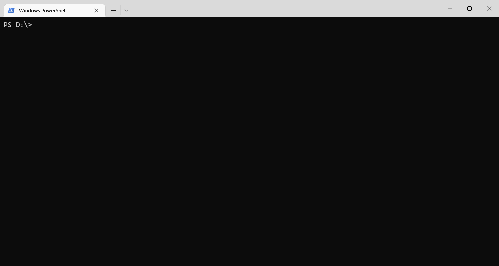
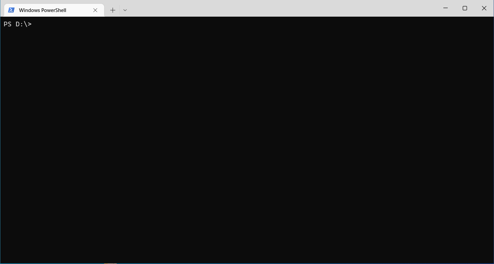

# FreeRTOS Ported to RH850

This provides a very basic port of FreeRTOS to RH850.

## Requirement

1. [GCC](https://github.com/mikisama/Auto_Build_GCC_RH850/releases) or [IAR](https://www.iar.com/products/architectures/renesas/iar-embedded-workbench-for-renesas-rh850) or [GHS](https://www.ghs.com/products/v850_development.html) or [CCRH](https://www.renesas.com/eu/en/software-tool/c-compiler-package-rh850-family)
2. [CMake](https://github.com/Kitware/CMake/releases)
3. [Ninja](https://github.com/ninja-build/ninja/releases)
4. [RFP](https://www.renesas.com/us/en/software-tool/renesas-flash-programmer-programming-gui)

## How to Build

<details>
<summary>Build with GCC</summary>

### Add toolchain path to the environment(PATH) variable.
```bash
$ # Set the PATH Environment Variables in Windows PowerShell
$ $env:path+=';D:/v850-elf-gcc-win32-x64/bin'
$ $env:path+=';C:/Program Files (x86)/Renesas Electronics/Programming Tools/Renesas Flash Programmer V3.08'
$ v850-elf-gcc --version
$ rfp-cli --version
```

### Build command
```bash
$ git clone https://github.com/mikisama/FreeRTOS_RH850
$ cd FreeRTOS_RH850/build
$ cmake -DCMAKE_TOOLCHAIN_FILE='cmake/gcc.cmake' -DCMAKE_BUILD_TYPE=Debug -GNinja ..
$ ninja
```

</details>

<details>
<summary>Build with IAR</summary>

### Add toolchain path to the environment(PATH) variable.
```bash
$ # Set the PATH Environment Variables in Windows PowerShell
$ $env:path+=';C:/Program Files (x86)/IAR Systems/Embedded Workbench 8.1/rh850/bin'
$ $env:path+=';C:/Program Files (x86)/Renesas Electronics/Programming Tools/Renesas Flash Programmer V3.08'
$ iccrh850 --version
$ rfp-cli --version
```

### Build command

```bash
$ git clone https://github.com/mikisama/FreeRTOS_RH850
$ cd FreeRTOS_RH850/build
$ cmake -DCMAKE_TOOLCHAIN_FILE='cmake/iar.cmake' -DCMAKE_BUILD_TYPE=Debug -GNinja ..
$ ninja
```

</details>

<details>
<summary>Build with GHS</summary>

### Add toolchain path to the environment(PATH) variable.
```bash
$ # Set the PATH Environment Variables in Windows PowerShell
$ $env:path+=';C:/ghs/comp_201815'
$ $env:path+=';C:/Program Files (x86)/Renesas Electronics/Programming Tools/Renesas Flash Programmer V3.08'
$ ccrh850 --version dummy
$ rfp-cli --version
```

### Build command
```bash
$ git clone https://github.com/mikisama/FreeRTOS_RH850
$ cd FreeRTOS_RH850/build
$ cmake -DCMAKE_TOOLCHAIN_FILE='cmake/ghs.cmake' -DCMAKE_BUILD_TYPE=Debug -GNinja ..
$ ninja
```

</details>

<details>
<summary>Build with CCRH</summary>

### Add toolchain path to the environment(PATH) variable.
```bash
$ # Set the PATH Environment Variables in Windows PowerShell
$ $env:path+=';C:/Program Files (x86)/Renesas Electronics/CS+/CC/CC-RH/V2.04.00/bin'
$ $env:path+=';C:/Program Files (x86)/Renesas Electronics/Programming Tools/Renesas Flash Programmer V3.08'
$ ccrh -v
$ rfp-cli --version
```

### Build command

```bash
$ git clone https://github.com/mikisama/FreeRTOS_RH850
$ cd FreeRTOS_RH850/build
$ cmake -DCMAKE_TOOLCHAIN_FILE='cmake/ccrh.cmake' -DCMAKE_BUILD_TYPE=Debug -GNinja ..
$ ninja
```

</details>
