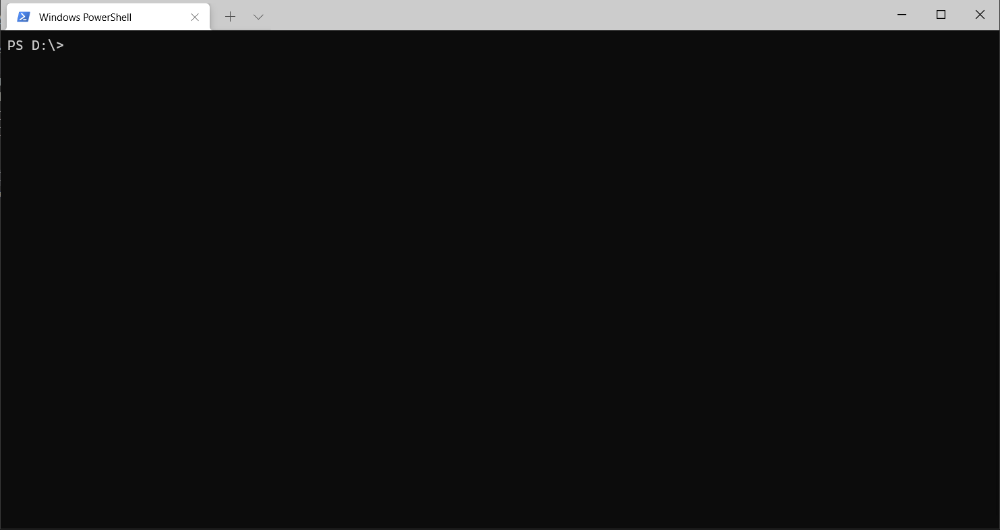

# FreeRTOS Ported to RH850

This provides a very basic port of FreeRTOS to RH850.

## Requirement

1. [GCC](https://github.com/mikisama/Auto_Build_GCC_RH850/releases) or [IAR](https://www.iar.com/products/#/search?architecture=RH850) or [CCRH](https://www.renesas.com/eu/en/software-tool/c-compiler-package-rh850-family)
2. [CMake](https://github.com/Kitware/CMake/releases)
3. [Ninja](https://github.com/ninja-build/ninja/releases)

## How to Build

Depend on the compiler you are using, modify the `INSTALL_DIR` variable in the CMake toolchain file as needed.

Modify the `V850_GCC_DIR` variable in `gcc.cmake` for example.

```bash
$ cmake -DCMAKE_TOOLCHAIN_FILE='cmake/gcc.cmake' -DCMAKE_BUILD_TYPE=Debug -Bbuild -GNinja .
$ cmake --build build
```



## Code Size

| compiler | Debug | Release | RelWithDebInfo | MinSizeRel |
| -------- | ----- | ------- | -------------- | ---------- |
| IAR      | 15786 | 14866   | 14866          | 14066      |
| GCC      | 30776 | 23376   | 21092          | 18912      |
| CCRH     | 26952 | -       | -              | -          |

This table shows the size of firmware.bin generated by using different `CMAKE_TOOLCHAIN_FILE` and `CMAKE_BUILD_TYPE`.
